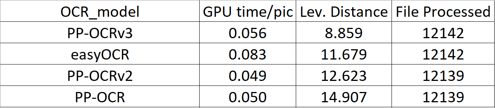

# Motivation 

The goal of my project is to identify an OCR model that achieves high accuracy on the Hateful meme dataset while maintaining low latency per image on GPU. Furthermore, my goal is to extend the OCR model for multilingual purposes in other languages.

# Solution

I tested over 90+ OCR models using the following open-source packages:
- [PaddleOCR](https://github.com/PaddlePaddle/PaddleOCR)
- [EasyOCR](https://github.com/JaidedAI/EasyOCR)
- [MMOCR](https://github.com/open-mmlab/mmocr)
- [Hugging Face](https://huggingface.co/blog/document-ai)
- [Tesseract OCR](https://github.com/tesseract-ocr/tesseract) (pytesseract)
- [Kraken](https://github.com/mittagessen/kraken)

I have found that PaddleOCR and EasyOCR consistently deliver the best results in terms of accuracy and performance. Specifically, PP-OCRv3 from PaddleOCR stands out as the top-performing model based on the Levenshtein Distance metric and GPU latency.

# Dataset
The evaluated dataset is retrieved from the [Hateful memes dataset](https://ai.facebook.com/tools/hatefulmemes/) by Facebook AI Research. 

# Get started 

To begin, make sure you have `Python 3.10` installed. If you're using a version older than `3.8`, there might be compatibility issues. Create a Conda environment with `Python 3.10` by running the following command:

`conda create -n test_env python=3.10`

Once Conda is installed, you can set up the necessary packages either for CPU running or GPU running. For CPU running, we run `setup_cpu.sh` file using the command:

`source setup_cpu.sh`

For GPU running, we run `setup_gpu.sh` file using the command:

`source setup_gpu.sh` 

# Image processing step 

To perform inference on an example image using PaddleOCR, you can use the `main.py` file. The default image for inference is `00002.png`. Alternatively, you can specify a different image as a command-line argument, as shown below:

`python3 main.py --img 00002.png`

# Performance

The top performance comparison of various OCR models is summarized in the table below:

According to the Levenshtein Distance metric and GPU latency, PaddleOCR's PP-OCRv3 demonstrates the best performance among the evaluated models. All PaddleOCR models lay among the top four best models along with easyOCR.

# Multilingual purpose
PaddleOCR supports over [80 languages](https://github.com/PaddlePaddle/PaddleOCR/blob/release/2.6/doc/doc_en/multi_languages_en.md#language_abbreviations). The API can be used for multilingual purpose without specifying the language parameter.

# License
This package is under the Apache-2.0 license.

# Authors
Tung Nguyen